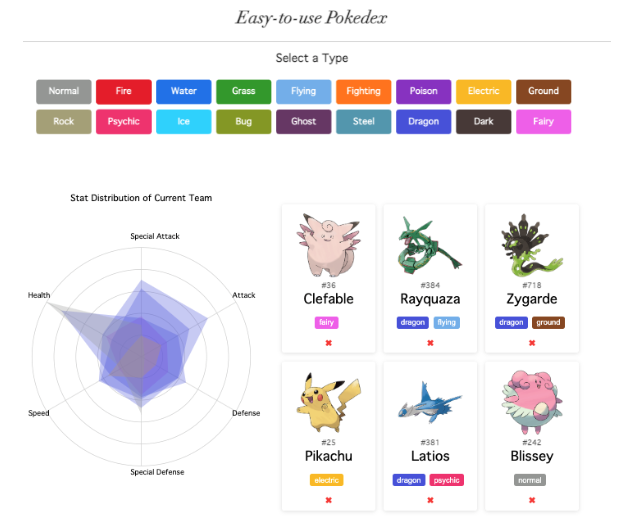

# PocketPokedex

Pokémon, an abbreviation for Pocket Monsters, is a series of video games founded by the Japanese company Nintendo and developed by Game Freak. Pokémon are fictional creatures that live in the wild, and can be caught and trained to live alongside their human partners. In this game, players are able to catch wild Pokémon, breed them, and battle against other players’ Pokémon. Each Pokémon has a unique set of statistics that categorizes and determines their combat capabilities such as Type, Health, Attack, etc. It is important to understand the stats of each Pokémon in order for players to strategize for combat and build teams according to their stats. The Pokémon franchise has millions of players worldwide, hence it is important to understand the stats for each Pokémon. Therefore, our group would like to visually show the distribution of Pokémon stats and the summaries of statistics related, thereby encouraging beginners to have an idea of Pokémon battle and also allowing players to look up desired stats easily. Our project visually displays the variety and range of stats of all the Pokémon up to the seventh generation. Users can browse, analyze and build teams of Pokémon based on their type or individual statistics to support the user’s gaming needs and experience.

PocketPokedex will present you all information about Pokémon and allow you to build a team of your choices

